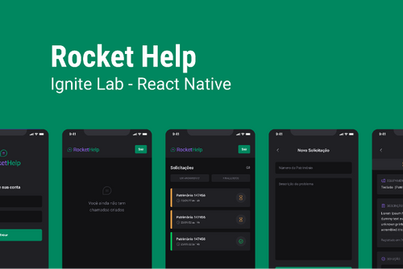

## RocketHelp
-Aula 1
 Desenvolvimento da tela de login com Native Base
 Oque é Native Base? Uma Ferramenta de Interface que nos ajuda
 a ter Produtividade
 Utilizamos Fontes personalizadas do Google e Carregamento de Fontes
 Fundamentos do React-Native
 Reaproveitamento de codigo com Components e Passar Propriedades
 useState Para Autualização em Tempo Real na Tela

- Aula 2
  Desenvolvemos o resto das Interfaces
  Adicionamos Navegação
  Definição de de Tipagem para as rotas e Tipos de Parametros
  que a Rota Vai Receber
  Aprendemos como Recuperar Parametros da Rotas

- Aula 3
  Integrçao com Firebase

===

### :computer: Tecnologias:
- React-Native
- Expo Go
- Typescript
- Native Base
- Firebase
- Google Fonts

### Evento: [Ignite Lab - ReactNative]
===

---
***</>*** **by [Rocketseat](https://github.com/rocketseat-education)**
